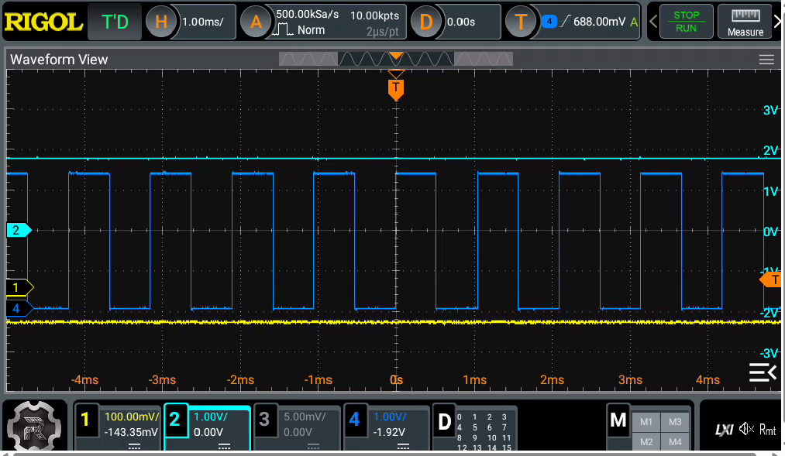
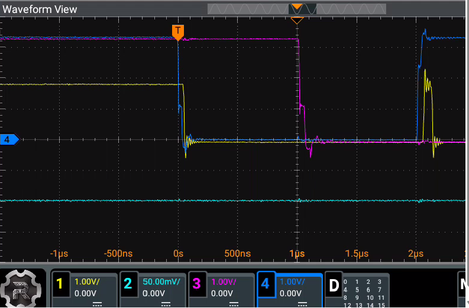
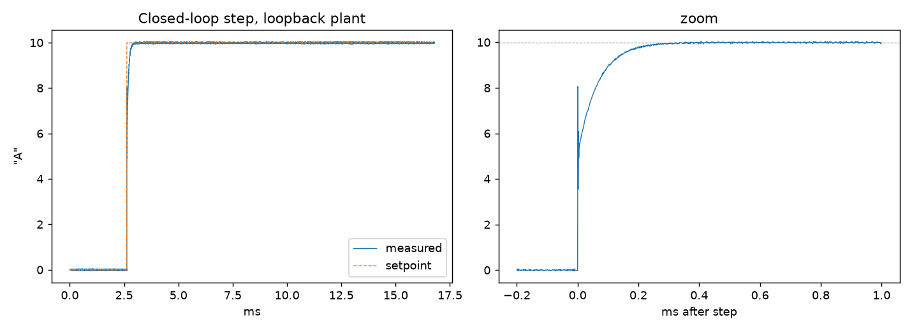
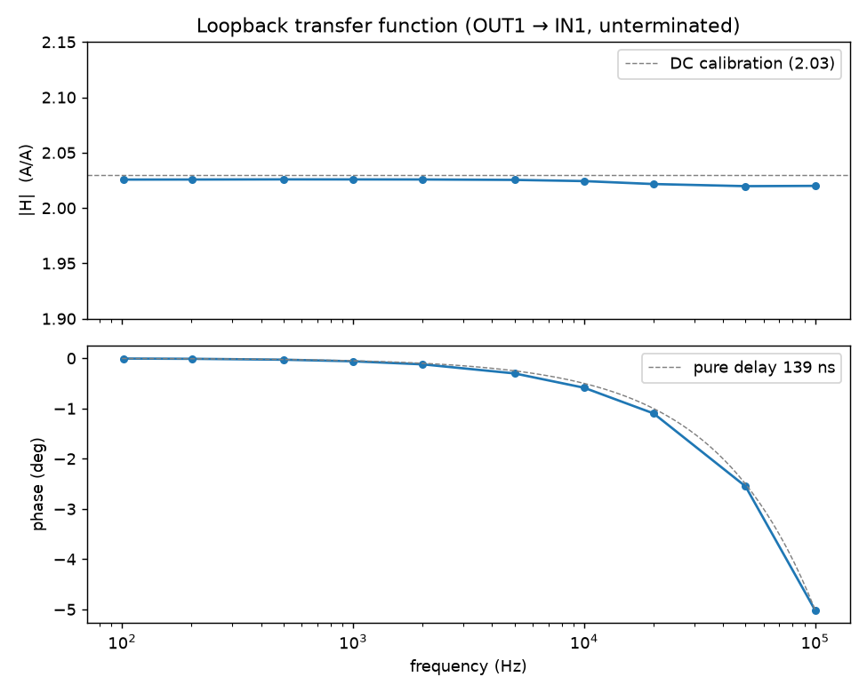

# Coil servo — first hardware bring-up (MOT board)

**Date:** 2026-08-27 | **Board:** Red Pitaya STEMlab 125-14 ("mot"
channel), 192.168.0.65 (wired) | **Bitstream:** coil_servo.bit.bin, built
on lab NUC (WSL2, Vivado 2025.1), timing MET | **Setup:** nothing connected
to SMAs or power stage; E1 jumper wires only; scope on SMA outputs and E1
pins.

## Summary

First deploy of the servo FPGA design onto real hardware. Verified:
register link, fabric clock, safe power-on state, watchdog heartbeat
(including deliberate cut-out), arm input, fault input, per-input polarity
inversion (dio_invert), hard output clamp + anti-windup, OUT1/OUT2 mutual
exclusion, and the complete H-bridge flip sequence with dead time — the key
safety behavior — captured on the scope. All results matched the simulated
design exactly.

## 1. Deploy and register link

`deploy mot` loaded the FPGA ("BIN FILE loaded through FPGA manager
successfully", 66 ms); `check mot` reported:

- **Heartbeat counter ADVANCING** — delta between two polls ≈ 6.49 × 10⁶
  ticks in ~52 ms = **fabric clock confirmed at 125 MHz**.
- LED walk on the board → register *writes* work.
- State IDLE, armed 0, fault 0, bridge_en 0, polarity 0 → **safe power-on
  state as designed** (bridge open, DACs zero).
- Measured current +0.164 A with nothing connected = ~11 ADC counts
  ≈ 1.3 mV input offset (uncalibrated ADC; folds into I_FS calibration
  later).

## 2. Watchdog heartbeat and cut-out test

- DIO6 (E1 pin 15): ~954 Hz square wave, ~3.3 V, exactly as designed
  (125 MHz / 2¹⁷).
- **Cut-out test:** `ssh reboot` → heartbeat goes flat within seconds
  (factory FPGA image has no heartbeat) and stays flat until redeploy, when
  it returns immediately. This flatline is the "controller dead" signature
  the external monostable must act on.
- **Still to do:** build/wire the monostable and repeat this test watching
  it drop bridge enable.

## 3. Arm input and clamp/anti-windup observation

*Scope, 1 ms/div: CH4 heartbeat (954 Hz), CH2 OUT2 railed at the clamp,
CH1 OUT1 at exactly 0 V.*

Jumper E1 pin 1 (3V3) → pin 11 (arm): `armed` flag set; with
`servo_enable=1`, state IDLE → RUN and bridge enable went high. With
setpoint 0 and the ~11-count phantom offset on the open IN1 input, the loop
railed the clamp output — as expected with no plant to respond:

| Trace | Signal | Observation | Meaning |
|---|---|---|---|
| CH4 | Heartbeat (pin 15) | 954 Hz square wave | fabric alive |
| CH2 | OUT2 (clamp cmd) | flat at maximum (~1.9 V unloaded) | **hard clamp caught the wound-up integrator**; anti-windup holds it exactly at the limit |
| CH1 | OUT1 (pass bank cmd) | exactly 0 V | **mutual exclusion**: never both outputs active |

## 4. Flip sequence — the safety-critical capture

*Single-shot flip capture, 500 ns/div: CH4 bridge enable low from 0 to
2 µs, CH3 polarity toggling at 1 µs, CH1 OUT1 gated off at t = 0, CH2 OUT2
flat.*

Jumper touch 3V3 → E1 pin 9 (flip request) while in RUN. Single-shot
capture (note: CH3 = pin 3 polarity, CH4 = pin 5 bridge enable):

| Time | Event | Verifies |
|---|---|---|
| t = 0 | Bridge enable (CH4) drops; OUT1 (CH1) snaps to zero simultaneously | outputs are gated off the instant the bridge opens |
| t = 1 µs | Polarity (CH3) toggles — single edge, all four bridge FETs off on both sides | dead time #1 = 125 ticks × 8 ns, as configured |
| t = 2 µs | Bridge enable returns | dead time #2; total bridge-open window 2.00 µs |

**Conclusion: the polarity edge sits strictly inside the enable-low window
with dead time on both sides — the bridge can never be flipped while
conducting.** (Safety invariant #4; this is what protects the bridge FETs
from absorbing the coil's stored energy, ½LI², at up to 100 A.) Successive
flips also swap which of OUT1/OUT2 rails, confirming the drive-frame
polarity rotation. Edge ringing on the capture is probe/ground-lead
artifact.

## 5. Fault input (DIO5)

3V3 → E1 pin 13: the `fault` flag appeared in the live status display while
the jumper was touching and cleared on removal — the input path (pin →
synchronizer → status bit) works. As designed, nothing else reacts: this
pin is where the hardware interlock chain reports a trip; the firmware only
*reports* it (and the measurement tools warn loudly if it is set), while
enforcement and latching stay entirely in the interlock hardware.

## 6. dio_invert register (software input-polarity flips)

All jumpers removed; each input's sense inverted in software and the
corresponding effect observed with no wire attached: fault-bit inversion
set/cleared the `fault` flag; arm-bit inversion armed the board (state
RUN); and toggling the flip-bit inversion 0→1 created rising edges the FSM
treated as real flip requests — polarity stepped 0 → 1 → 0 across two such
edges, with the falling edge correctly ignored. Register restored to 0
afterwards (normal sense). This confirms that if the real level-shifted
wiring turns out inverted (e.g. an active-low interlock line), the fix is
one config value, not an FPGA rebuild.

## 7. Analog loopback (SMA OUT1 → IN1, unterminated)

**First closed feedback loop on hardware.** With the loop closed (setpoint
655 counts ≡ 10.0 "A"), `i_meas` regulated onto the setpoint exactly,
silently compensating the chain's gain and offset errors — the drive
settled at u14 = 605 counts, precisely what the calibration below demands
(2.03 × 605 − 574 = 654). Residual fluctuation ±30 mA ≈ ±2 ADC counts: raw
ADC noise plus the loop hunting ±1 DAC step (the loopback passes DAC steps
straight through; a real coil low-passes them). ±30 mA is ±0.024 % of the
125 A scale, inside the 0.1 % stability budget.

**Raw-path calibration of this board** (uncalibrated converters — the
factory EEPROM corrections are not applied in our FPGA path). Three
operating points — open-loop (drive 1000 → read 1455), closed-loop
(605 → 655), and outputs-off (0 → −574) — lie on one line:

**read = 2.03 × drive − 574 counts**

i.e. the textbook 2× high-impedance doubling (output calibrated for 50 Ω,
IN1 is 1 MΩ), times ordinary converter gain spread, plus a DAC-referred
zero offset of ≈ −35 mV (−574 read counts ≈ −70 mV at IN1 after doubling).
A single-point measurement earlier had conflated these into an apparent
"1.455× factor"; a scope cross-check at drive 1000 read 206 mV at OUT1.
Absolute calibration folds into I_FS per channel later and the closed loop
is insensitive to all of it — this exercise characterizes the instrument so
converter quirks are never mistaken for sensor physics on the real coil.

**Tooling bug found and fixed during this session:** a fresh `Board`
connection began with an empty local copy of the config block, so its first
register write cleared unmentioned fields sharing the same word — observed
live as `write_cfg(open_loop=1)` from a new session clearing
`servo_enable` (graceful stop, outputs to zero: the failure was at least
safe). Fixed: the client now reads the FPGA's actual config into its local
copy at connect. Regression test added.

## 8. Closed-loop step response (loopback)

*Closed-loop 10 "A" step through the loopback: full 16.8 ms record (left)
and zoom on the edge (right). Raw data: [data/step_loopback.csv](../data/step_loopback.csv).*

`step mot --amps 10` through the loopback (an accidental first run with the
cable still on the scope instead produced a useful figure of its own: the
open-loop integrator slewing OUT2-rail → handoff → OUT1-rail at the
configured Ki, ~600 µs per rail — the "handoff + clamp + integral action"
figure). With the loop closed:

| Quantity | Measured | Comment |
|---|---|---|
| 10–90 % rise | 102 µs | closed-loop bandwidth ≈ 3.5 kHz — ~6× faster than the open-loop integrator ramp; feedback at work |
| Settle to ±1 % | 259 µs | no overshoot |
| Tail mean | 9.991 "A" vs 9.987 target | on-target to 0.04 % |
| Tail noise | 17 mA rms | DAC-LSB hunting (22 mA/step through the 2.03× loopback) + raw ADC noise; the loopback passes DAC steps unfiltered — a real coil integrates them away. 0.1 % spec band at rated current is ±100 mA, ~6σ above this floor |

## 9. Swept-sine transfer function (loopback) — measurement toolchain validated

*Loopback Bode plot: |H| flat at 2.024 across 100 Hz – 100 kHz (dashed: DC
calibration), phase fitting a pure 139 ns differential delay. Raw data:
[data/tf_loopback.csv](../data/tf_loopback.csv).*

Function generator on IN2 (sine, positive offset so the drive stays on
OUT1), board in open-loop mode, `sweep` auto-detecting each frequency from
the synchronous stimulus/response capture. Ten points, 100 Hz – 100 kHz:

- **|H| = 2.024, flat to 0.3 % over three decades** — matching the DC
  calibration line (2.03) to a fraction of a percent.
- **Phase fits a pure 139 ns delay** (−5° at 100 kHz). Better than naively
  expected: the ~3.6 µs digital pipeline latency is *common* to the
  stimulus and response channels and cancels in the ratio, leaving only the
  differential DAC/analog path. The instrument therefore contributes
  essentially no phase error in the loop's band — measured phase on the
  real coil will be plant physics.
- The tone detector initially also logged ~60 Hz mains pickup from the
  undriven input (stimulus ~4 mA, obvious in the stim column); `sweep` now
  rejects detections below 0.05 A of stimulus (`--min-stim`).

With this, every measurement tool (`check`, `watch`, `step`, `sweep`) has
been validated against known truth. Any structure seen on the dummy load or
real coil is physics, not instrument.

## Remaining on the board-only checklist (bringup.md §3b)

- Optional: scope OUT1 at drive 0 to split the −35 mV offset between DAC
  and ADC.
- Monostable build + heartbeat-loss test (section 2 above).

## Reference

- Repo: github.com/Rb-Cs/coil-servo ([bringup.md](bringup.md) is the
  checklist; [design.md](design.md) the loop design).
- Config: channels.toml defaults — clamp 6554 counts (100 % of 100 A
  rated), dead time 1 µs, zero window 0.5 A, all PROVISIONAL values pending
  measurement.
- Live display used throughout: `python -m coil_servo_host.watch mot`.
