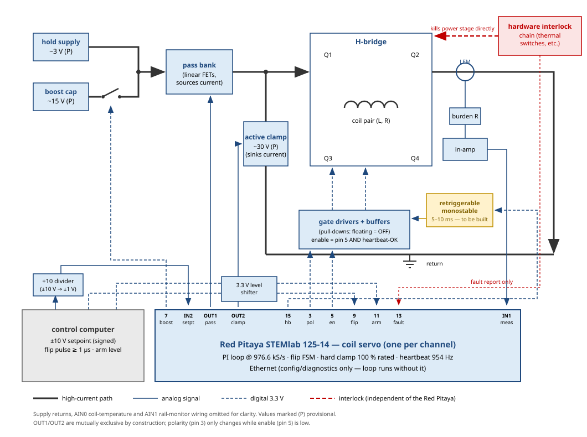

# Coil current servo — interface brief for the power electronics

**Purpose:** what the digital servo (Red Pitaya STEMlab 125-14, one per coil
channel, custom FPGA firmware — commissioned 2026-08-27) does as a black
box, and the requirements it places on the circuits connected to it.
Channels: MOT anti-Helmholtz (100 A rated), X/Y/Z shims (60 A rated).

## 1. Black-box function

The box measures the coil current as a voltage on one analog input, runs a
PI feedback loop in hardware (FPGA — deterministic, updated every 1.02 µs),
and drives two analog command outputs: one telling the linear pass bank how
hard to *source* current, one telling the active clamp how hard to *pull it
down*. It also sequences the H-bridge polarity flips (ramp to zero → open
bridge → dead time → toggle polarity → dead time → close → resume) and
enforces the safety rules below in silicon. A computer connects only over
Ethernet for configuration and diagnostics; if the network dies, the loop
keeps running.

*System schematic. Thick dark lines: high-current path; solid blue:
analog signals; dashed blue: 3.3 V digital; red: the interlock chain,
which acts on the power stage directly and only reports to the board.*

## 1b. Capabilities at a glance

Numbers marked (P) are PROVISIONAL — they assume the ~15 V boost rail,
the illustrative ~30 V clamp, and resistances pending Kelvin measurement.

| Channel | Rated current | Resolution (1 ADC count) | Boost ramp 0 → rated (P) | Clamp ramp rated → 0 (P) | Full reversal, electrical (P) |
|---|---|---|---|---|---|
| MOT anti-Helmholtz | 100 A (bipolar) | 15 mA | ~120 µs (0.9 A/µs) | ~55 µs | ~0.25 ms |
| Z shim | 60 A (bipolar) | 9 mA | ~120 µs (0.5 A/µs) | ~60 µs | ~0.25 ms |
| X / Y shim | 60 A (bipolar) | 9 mA | ~230 µs (0.26 A/µs) | ~115 µs | ~0.4 ms |

- **Command clamp at 100 % of rated** (unexceedable in software);
  measurement range extends to 125 % of rated, so overshoot is still seen.
  DC resolution is finer than one count — the loop dithers/averages
  through the quantization (bench: held setpoint to 0.04 %).
- **Loop:** PI at 976.6 kS/s (1.02 µs per correction), ~3.6 µs digital
  latency; target crossover 2–5 kHz; commissioned closed-loop bandwidth
  ≈ 3.5 kHz (loopback), 10–90 % rise 102 µs, ±1 % in 259 µs, no
  overshoot. Spec: settle to 0.1 % in < 1 ms.
- **Ramp shapes:** the loop tracks an arbitrary analog setpoint up to its
  bandwidth — shaped (adiabatic) ramps are programmed at the control
  computer; a setpoint step slews at the physical maximum (boost up,
  clamp down). Snap-off to zero does not open the bridge.
- **Stability:** spec < 0.1 % of rated; bench 17 mA rms / on-target to
  0.04 % (worst-case unfiltered plant). Estimated real-system floor
  ~0.01 %, set by the sensor/burden/setpoint chain, not the servo.
- **Reversal:** explicit-trigger only (≥ 1 µs pulse); ramp to zero →
  ±0.5 A window held ~66 µs → 2 µs bridge-open with 1 µs dead time each
  side of the polarity edge → resume. Chamber eddy settling (unmeasured)
  adds on top of the electrical time.
- **Continuous duty:** indefinite hold at rated current from the servo's
  side; the limits are thermal, outside the board (see section 6). Loop
  runs autonomously in the FPGA — network loss changes nothing.

## 2. Analog interfaces (SMA)

| Port | Function | Electrical | Requirements on the connecting circuit |
|---|---|---|---|
| IN1 | Measured coil current (the feedback signal) | ±1 V range, 1 MΩ, DC-coupled, 14 bit @ 125 MS/s | LEM secondary → burden resistor → instrumentation amp, **signed (coil-side)**, scaled so full scale (+1 V) ≈ 1.25 × rated current (rated sits at 80 % of range, leaving headroom to *measure* overshoot; the drive itself is clamped at 100 % of rated). Absolute scale is calibrated in software afterwards — the burden choice only needs to land in the right ballpark. |
| IN2 | Current setpoint from the control computer | same as IN1 | ±10 V analog out through a ÷10 divider. **Must use the same volts-per-amp scaling as IN1** (the loop subtracts them directly), and its sign must track the bridge polarity. |
| OUT1 | Pass bank command ("source this much current") | 0 … +0.8 V full command (into 50 Ω; ×2 if unterminated), 50 Ω source, updated at 976.6 kS/s | 0 V (or below) = fully off; rising voltage = conduct more, with ~0.8 V ≈ rated current at the intended transconductance. **The reference input must treat ≤ 0 V as zero drive and tolerate a small negative resting offset** (measured ≈ −35 mV at DAC code zero on the bench board — raw converters are uncalibrated). |
| OUT2 | Active clamp command ("absorb this much") | same as OUT1 | Same conventions (an inverted-polarity convention is available in configuration if the conditioning chain prefers it). Guaranteed **never active simultaneously with OUT1**, with a small dead-band gap at the handoff. |

*Loop dynamics for context: target crossover 2–5 kHz; commissioned
closed-loop bandwidth ≈ 3.5 kHz on a loopback plant; the digital path
contributes ~3.6 µs of loop latency — the analog chain (gate charge,
source-sense op-amp bandwidth, coil) is expected to set the achievable
bandwidth, not the digital side.*

## 3. Digital interface (E1 header — 3.3 V logic, unbuffered, NOT 5 V tolerant)

| Signal (E1 pin) | Dir | Behavior | Requirements on the connecting circuit |
|---|---|---|---|
| Bridge polarity (3) | out | Static level selecting the H-bridge diagonal; changes only mid-flip, while enable is low | Weak drive (4 mA, slow slew) — buffer locally at the gate-driver board. |
| Bridge enable (5) | out | High = bridge may conduct; low = all four FETs off | **Low, floating, or high-Z must all mean OFF** — the pin is undefined for ~1 s during the board's Linux boot, so the gate driver needs its own pull-down. "Enable low with either polarity = safe non-conducting state" is assumed by the flip logic. |
| Boost enable (7) | out | Switches in the ~15 V boost rail during fast ramps (automatic or manual per config) | Same class as bridge enable (default-off wiring). |
| Flip request (9) | in | Rising edge triggers the flip sequence (honored only while armed) | 3.3 V level via level shifter; pulse ≥ 1 µs. Internal pull-down: disconnected = no request. |
| Arm (11) | in | High = servo may enable the bridge and accept flips; losing arm mid-run does *not* drop the bridge | 3.3 V level; internal pull-down: disconnected = disarmed. |
| Interlock fault (13) | in | Report-only: shown to operators/tools. The servo has no path to clear or act on it — enforcement stays in the interlock hardware | 3.3 V level from the interlock chain; either polarity is fine (configurable in software) — please tell us which, and prefer the convention where a broken cable reads as "fault". |
| Heartbeat (15) | out | ~954 Hz square wave, running unconditionally from power-on; **stops only if the FPGA is dead** (verified on the bench, including deliberate kill/recovery) | **Requirement: a retriggerable monostable** (suggest 5–10 ms timeout) that gates bridge enable off when the heartbeat stops, and does not re-enable on its own when it returns. This is the protection against a dead/hung/mid-reprogram controller — it must live outside the Red Pitaya. Needs building; we can discuss ownership. |
| 3V3 (1, 2) / GND (25, 26) | — | Available on the header | All logic referenced to board ground. |

### Field-reversal choreography (contract for the control computer)

IN2 carries the **full signed setpoint** (magnitude and direction), but the
sign does not command a flip — it must *agree with* the bridge polarity that
the flip line has established. To reverse the field from +I to −I, the
control computer does two things:

1. **Pulse the flip request line** (E1 pin 9, ≥ 1 µs). The servo ramps the
   current to zero, verifies it, reverses the bridge with dead time, and
   resumes — ignoring the setpoint throughout (internally forced to zero).
2. **Swap the analog setpoint sign** (+I → −I) any time while the flip is
   in progress.

If the setpoint sign and bridge polarity ever disagree, the hardware cannot
produce that current direction; the servo sits safely at zero and raises
the `sp_sign_mismatch` status flag until they agree — a sequencing mistake
costs field, never hardware. Flips are deliberately *never* triggered by
the setpoint changing sign: a reversal is a disruptive, milliseconds-long
event the experiment must schedule explicitly, not a side effect of a
setpoint ramp passing through zero.

## 4. What the box guarantees (enforced in the FPGA, verified in test + on the bench)

- **Power-on/reset state is fully off:** both analog outputs at code zero,
  all digital outputs low, bridge disabled — before and independent of any
  software.
- **Hard command clamp at 100 % of the channel's rated current** — no
  software state, setpoint, or integrator wind-up can command beyond it.
- **OUT1 and OUT2 are mutually exclusive by construction** (single
  multiplexer; both-active is unrepresentable).
- **The bridge polarity never changes with the bridge enabled:** flips only
  proceed once the measured current has sat inside a zero window (default
  ±0.5 A) for ~66 µs, with 1 µs dead time (configurable) on each side of
  the polarity edge. A flip that cannot reach zero parks safely (bridge
  closed, servoing to zero) and waits for operator acknowledgment. Scope
  capture of the sequence available.
- **Software "off" is a graceful ramp-to-zero**, never an instantaneous
  bridge drop at current.
- Network/computer loss changes nothing: the loop holds its last
  configuration; protection is the heartbeat/monostable plus the interlock
  chain.

## 5. Commissioned performance (bench, loopback plant, 2026-08-27)

- Closed loop: 10–90 % rise 102 µs (≈ 3.5 kHz), settled to ±1 % in 259 µs,
  no overshoot, on-target to 0.04 %.
- Built-in swept-sine transfer-function measurement validated: magnitude
  flat to 0.3 % over 100 Hz – 100 kHz, instrument phase error equivalent to
  139 ns — plant measurements will be limited by the plant, not the
  instrument.
- Raw converter calibration measured (gain ≈ +2 % class per converter path,
  DAC zero ≈ −35 mV); absolute amps-per-volt is calibrated per channel in
  software.

## 6. Open questions for this discussion

- **Burden resistor / sensing scale:** value that puts rated current at
  ~80 % of ±1 V given the LEM ratio (2000:1) and its compliance against
  ±15 V supplies (10 Ω → 0.5 V @ 100 A; 16 Ω → 0.8 V).
- **Pass bank transconductance:** what current does +0.8 V command? And
  confirm behavior for inputs ≤ 0 V and in the −50…0 mV region (our resting
  offset).
- **Clamp stage transfer characteristic:** does OUT2 command a sink
  *current* (transconductance, like the pass bank) or an applied reverse
  *voltage*? Our simulations assume the former. Also the clamp voltage
  rating (couples to bridge FET selection).
- **Gate-driver logic:** confirm enable/polarity input thresholds, that
  floating inputs default to off, and buffering of our weak 3.3 V outputs.
- **Interlock fault line:** output polarity and level.
- **Thermal protection:** the interlock chain currently has no thermal
  input. Continuous running at rated current is a real use case
  (characterization runs: ~64 W in the MOT coil pair, order ~120 W in the
  linear pass bank at 100 A CW, provisional resistances) — we'd like
  thermal switches on the coil and pass bank in the interlock chain
  (type, thresholds, mounting?). A lower-threshold *graceful* soft-stop
  inside the servo may be added later, but hardware protection must not
  depend on the board.
- **Heartbeat monostable:** who builds it, and the timeout choice.
- **Rails:** confirm ~3 V hold / ~15 V boost, and boost switch control
  expectations (our pin 7 output).

*Full technical record: [docs/design.md](design.md) (loop design, every
number) and [docs/lab_notes_2026-08-27.md](lab_notes_2026-08-27.md)
(commissioning data and scope captures).*
